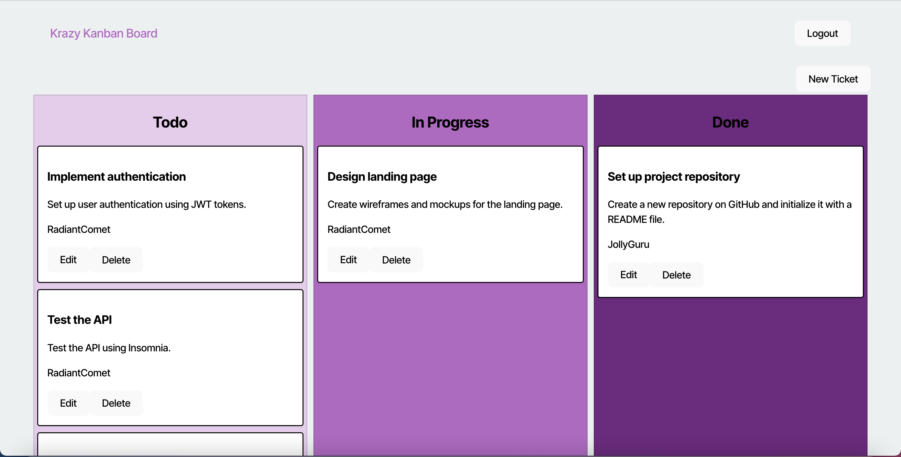

# 14--module-challenge

# Description
This project is a kanban application. This application accepts a username and password to login a user. Upon logging in the user will be presented with a kanban from local storage saved to their profile.
## Table of Contents
- [Insallation](#installation)
- [Usage](#usage)
- [Contribution](#contribution)
- [Tests](#tests)
- [Questions](#questions)
## Usage

- Github repo: <https://github.com/NicMiller35/14--module-challenge>
- Link to site: <https://one4-module-challenge.onrender.com/>
## Contribution
Nic Miller

## License
This is licensed under <https://opensource.org/licenses/MIT>
## Questions
If you have questions you can reach me at my GitHub or email below.
- <https://github.com/NicMiller35>
- nicmiller13@gmail.com